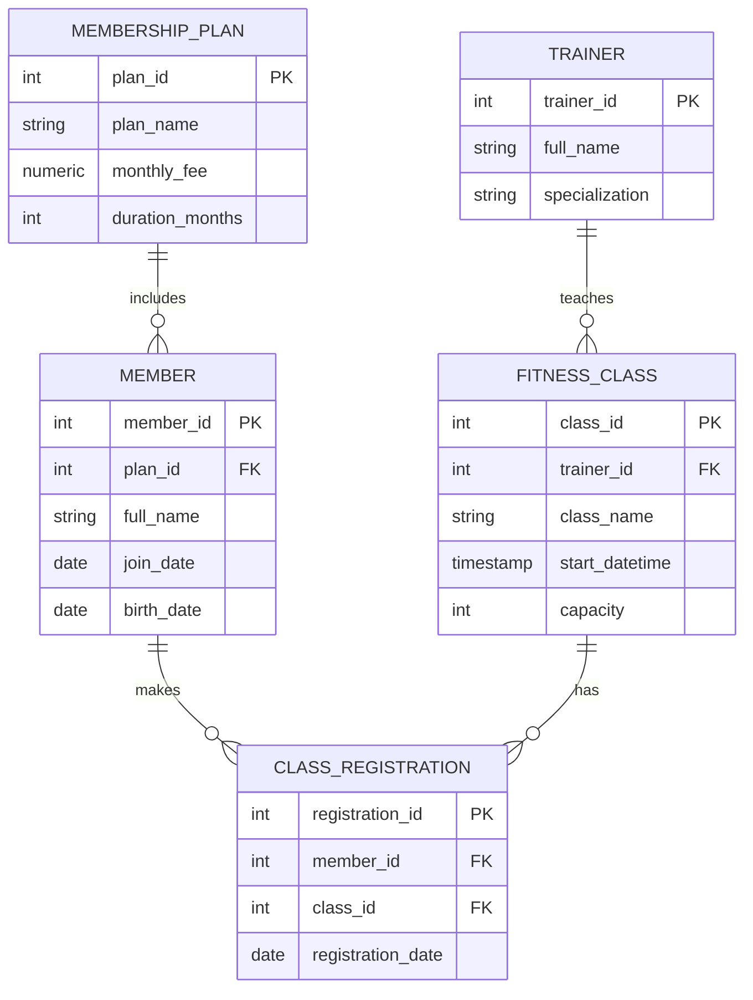

# ER Diagram — Gym Membership System

```mermaid
erDiagram
    MEMBERSHIP_PLAN ||--o{ MEMBER : includes
    MEMBER ||--o{ CLASS_REGISTRATION : makes
    FITNESS_CLASS ||--o{ CLASS_REGISTRATION : has
    TRAINER ||--o{ FITNESS_CLASS : teaches

    MEMBERSHIP_PLAN {
        int plan_id PK
        string plan_name
        numeric monthly_fee
        int duration_months
    }
    MEMBER {
        int member_id PK
        int plan_id FK
        string full_name
        date join_date
        date birth_date
    }
    TRAINER {
        int trainer_id PK
        string full_name
        string specialization
    }
    FITNESS_CLASS {
        int class_id PK
        int trainer_id FK
        string class_name
        timestamp start_datetime
        int capacity
    }
    CLASS_REGISTRATION {
        int registration_id PK
        int member_id FK
        int class_id FK
        date registration_date
    }
```
